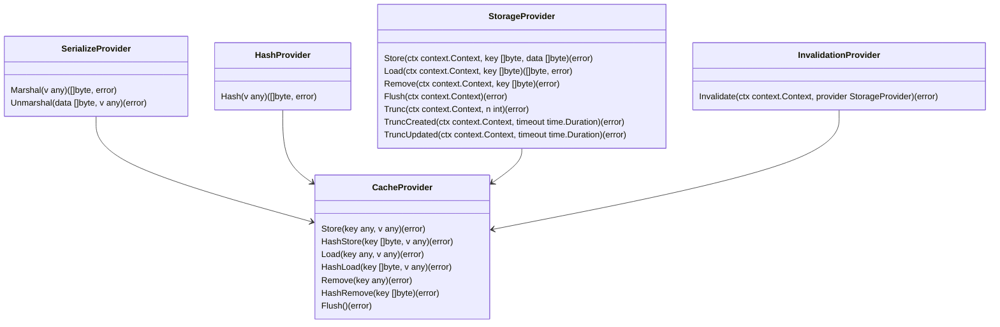

# XCACHE

> Easy to understand, flexible, and universal GoLang caching that
> supports in-memory, files, and DataBase caching.

## Architecture

### Points of Interests

- [ ] Standard cache (with default configs) for instant start.
- [ ] Maximum of interfaces (std-lib preferred) to support flexible customization.
- [ ] In-Memory, FileSystem, and DataBase cache providers.
- [ ] Static usage (for MSA) alongside with instances creation.
- [ ] Optional verbose logging.
- [ ] Any structure as a key alongside with binary key.
- [ ] Invalidation by time, size, usage, and count of records.
- [ ] Multi-Target caching (e.g.: In-Memory + DB).
- [ ] Optional Go 1.18 generics support for typed caching.

### Entities

#### Types

<details>
    <summary>Interface: <b>SerializeProvider</b> -- Value marshaling / unmarshaling</summary>
    Provides methods to marshal / unmarshal any object to / from binary.
    It might me JSON, BSON, GOB or any other representation.
</details>

<details>
    <summary>Interface: <b>HashProvider</b> -- Key hashing</summary>
    Provides methods to hash any object into binary to be used as a key.
    It might be <a href="https://github.com/cnf/structhash">structhash</a> or any other more
    specific algorithm. Pay attention to Go Maps because they not provides strict keys ordering.
    And maps with same keys and values must be equal.
</details>

<details>
    <summary>Interface: <b>StorageProvider</b> -- Cache storage and manipulation provider</summary>
    It might be In-Memory, FileSystem, or any DataBase provider. And must implements such
    methods as: Store, Load, Drop, and Invalidation mechanisms.
</details>

<details>
    <summary>Interface: <b>InvalidationProvider</b> -- Configuration and invalidation manager</summary>
    Accepts a configuration with invalidation parameters, and uses Provider to drop outdated
    records.
</details>

<details>
    <summary>Interface: <b>CacheProvider</b> -- All-in-one controller</summary>
    Units all mechanisms at one point and provides user-end API.
    Also provides Load, and Store timeouts.
</details>

#### Relationships



#### Concept

> Think about InvalidatorProvider.
> Does it needed? Maybe leave just InvalidationConfig with fields and delegate
> invalidation timeouts and managing to CacheProvider?

```go
cache := xcache.New()
    .WithName("in-memory")
    .WithLogger(log.DefaultLogger)
    .WithStorage(memory.New())
    .WithKeyHashing(md5.New())
    .WithValueSerializer(gob.New())
    .WithInvalidator( // Leave just a InvalidationConfig struct?
        ticker.New().Every(time.Seconds * 30).Trunc(100),
        ticker.New().Every(time.Minutes * 5).TruncCreated(time.Hour * 3),
        ticker.New().Every(time.Minutes * 1).TruncUpdated(time.Minutes * 30),
    )

multi := xcache.New(cacheA, cacheB)

cache.Store(obj, str)
cache.Load(obj, &str)
cache.StoreByHash(obj, str)
cache.LoadByHash(obj, &str)
```